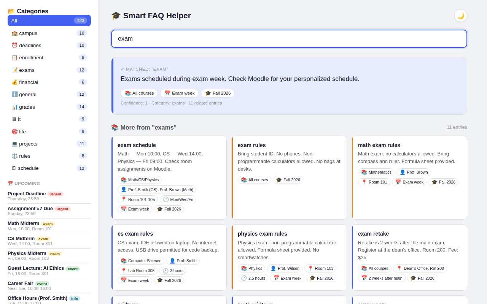
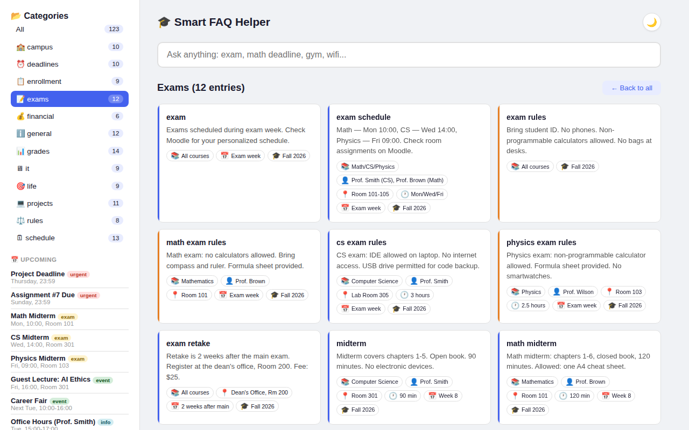
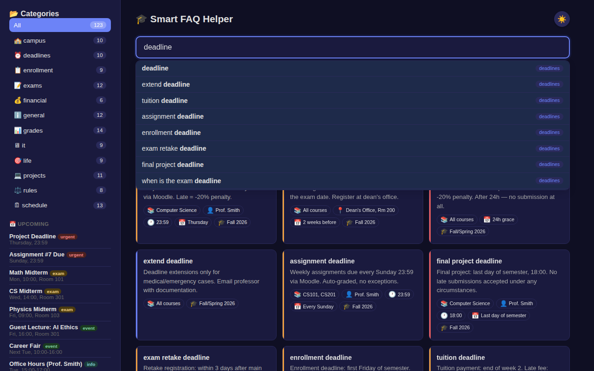

# Smart FAQ Helper

Full-stack FAQ system with contextual answers — students instantly get precise answers plus all related entries from the same category.

## Author Information

- **Name**: Bulatov Bulat
- **Email**: b.bulatov@innopolis.university
- **Group**: DSAI-03
- **GitHub**: github.com/bulat1223312

## Demo

### FAQ Search
Type a question, get the best match + all related entries from the same category.



### Category Browse
Click any category in the sidebar to see all entries at once.



### Dark Mode
Toggle dark mode for comfortable night-time studying.



## Product Context

### End Users

University students who need quick access to course information, deadlines, exam schedules, grading policies, campus resources, and other academic information.

### Problem

Students waste time searching through multiple course pages, Moodle, emails, and announcements to find basic information like deadlines, exam rooms, office hours, and submission rules. Information is scattered across many sources and hard to find quickly.

### Our Solution

A single-page web application with 112 FAQ entries across 12 categories. Hybrid fuzzy matching (55% character-level + 45% word-level Jaccard) finds the best match and returns all related entries from that category. Autocomplete, category browsing, dark mode, and query history make it fast and pleasant to use.

## Features

### Version 1 - Core MVP

| Feature | Status |
|---------|--------|
| Input field for questions | ✅ |
| Basic FAQ matching (keyword-based) | ✅ |
| Return predefined answers | ✅ |
| Simple backend (FastAPI) | ✅ |

### Version 2 - Final Product

| Feature | Status |
|---------|--------|
| Fuzzy search (smart matching using similarity) | ✅ |
| Database (store FAQ + history) | ✅ |
| History tracking | ✅ |
| Dockerized deployment | ✅ |
| Improved UI | ✅ |
| Category browsing with entry counts | ✅ |
| Autocomplete with keyboard navigation | ✅ |
| Metadata badges (room, time, date, professor) | ✅ |
| Color-coded types (info/warning/success/danger) | ✅ |
| Dark mode with localStorage persistence | ✅ |
| Search statistics API | ✅ |
| Upcoming events sidebar | ✅ |
| Responsive design (mobile-friendly) | ✅ |

### Not Yet Implemented

| Feature | Priority |
|---------|----------|
| LLM-powered chatbot integration | Medium |
| Multi-language support | Low |
| Admin panel for managing FAQs | Medium |
| Telegram bot interface | Low |
| Analytics dashboard | Low |

## Usage

### Web Interface

1. Open the app in your browser at `http://<host>:8000`
2. Type your question in the search bar (e.g., "exam", "deadline", "gym")
3. Use autocomplete suggestions or press Enter to search
4. View the best match answer + all related entries from the same category
5. Click category cards in the sidebar to browse all entries
6. Toggle dark mode with the moon icon

### API Endpoints

| Method | Path | Description |
|--------|------|-------------|
| GET | `/` | Frontend UI |
| GET | `/faqs?category=exam` | FAQ entries (optionally filtered) |
| GET | `/categories` | Category list with counts |
| GET | `/events` | Upcoming events |
| GET | `/search_suggestions?q` | Autocomplete (supports `&category=`) |
| POST | `/ask` | Get answer + all related category entries |
| GET | `/history` | Q&A history |
| GET | `/stats` | Search statistics |

## Deployment

### Requirements

- **OS**: Ubuntu 24.04 (or any Linux with Docker)
- **Docker** installed and running

### Step-by-Step Deployment

#### Option A: Docker (Recommended)

```bash
# Clone the repository
git clone https://github.com/bulat1223312/se-toolkit-hackathon.git
cd se-toolkit-hackathon

# Build the Docker image
docker build -t smart-faq-helper .

# Run the container
docker run -d -p 8000:8000 --name faq-helper smart-faq-helper

# Open in browser
# http://<your-host-ip>:8000
```

#### Option B: Direct Python

```bash
# Clone the repository
git clone https://github.com/bulat1223312/se-toolkit-hackathon.git
cd se-toolkit-hackathon

# Install dependencies
pip install fastapi uvicorn sqlalchemy

# Run the server
uvicorn main:app --host 0.0.0.0 --port 8000

# Open in browser
# http://localhost:8000
```

### Stopping the Service

```bash
# Docker
docker stop faq-helper
docker rm faq-helper

# Direct Python
# Press Ctrl+C in the terminal
```

## Links

- **GitHub Repository**: https://github.com/bulat1223312/se-toolkit-hackathon
- **Deployed Product**: http://10.93.25.49:8000
